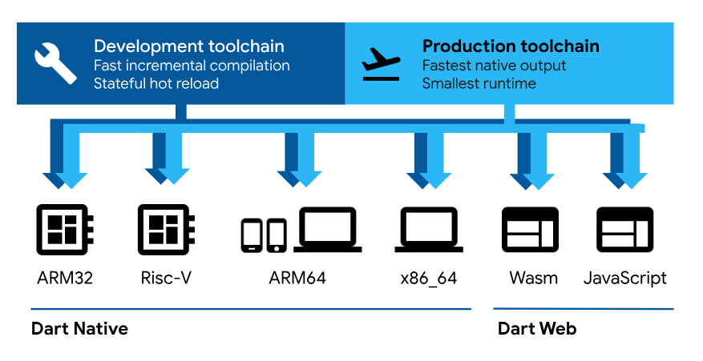
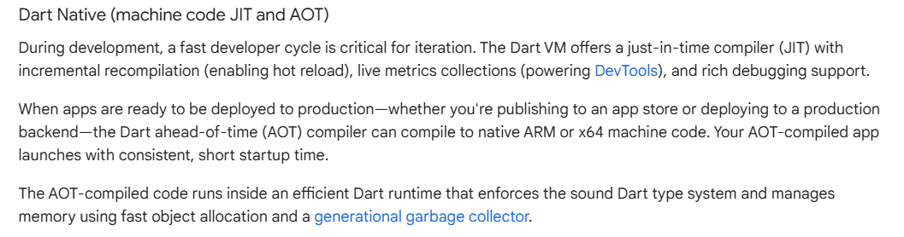

# Dart 동작 원리 및 특징 간단하게 정리해 boja

## dart.dev (공식홈페이지)

### 오피셜 Dart 특징 3가지

- Optimized for UI : dart는 UI에 최적화 되어있다.
- Productive development : 생산적인 개발환경을 가짐
- Fast on all platforms : 모든 플랫폼에서 빠름

## 오잉?? 모든 플랫폼에서 빠르다고??? 이게 무슨말인지 자세히 알아보도록 haja~

### Dart는 두 개의 컴파일러를 가지고 있다!

1. Dart web
2. Dart Native
   

- 첫번째로 그림을 보게 되면 Dart web은 내가 dart로 쓴 코드를 JavaScript로 변환해주는 컴파일러임.
- 두번째로 dart native는 내가쓴 dart 코드를 여러 CPU의 아키텍쳐에 맞게 변환해줌.
- 가령, 내 코드를 ARM32에 맞게 변환할 수 있고, 대부분의 모바일 폰에서 사용하는 ARM64에서도 사용가능함. (데스크탑도 마찬가지)
- 따라서, dart를 쓰는 것 만으로도 IOS, Android, Windows, Linux, Mac으로 컴파일 할 수 있다는거임.
- 심지어 더 작은 규모의 아키텍쳐로도 사용할 수 있어서 사물인터넷을 만드는데도 사용이 가능함.

## 그렇다면 Dart는 어떻게 컴파일이 되는 것인가?

1. just-in-time (JIT)
2. ahead-of-time (AOT)
3. 공식 문서
   

### 우리에게 익숙한 AOT 부터 살펴보면

- C, C++, Go 등으로 코딩을 다하고 나면 컴파일 할 때 아키텍쳐를 지정해줘야함.
  예를들어, C++로 프로그램을 다 만들었다고 가정해보자, 그리고나서 그 프로그램을 Linux 서버에 배포를 하려고하면
  나의 코드를 Linux 바이너리로 컴파일을 해줘야함. 그러면 C++ 컴파일러는 그걸 기계어로 컴파일 해주고(CPU가 이해할 수 있는 기계어),
  사람들이 컴퓨터에서 그 코드를 실행할 수 있게 해주는거임.
- 결론은 컴파일을 먼저하고, 그 결과인 바이너리를 배포하는거임

### 그러면 JIT 는 뭔데??

- JIT 컴파일러는 dart VM(virtual machine)을 사용하는데, 내가 쓴 코드의 결과를 바로 화면에 보여줌.
- 하지만 이건 코드가 가상머신에서 작동하고 있는거라서 조금 느리긴함.(그래서 개발중일때만 쓰임)
- 한마디로 내가 쓴 코드의 결과를 스크린에 몇초 안에 바로 확인할 수 있음
- 모든 것을 끝내고 앱을 배포할 땐 dart VM을 사용하지 않고 AOT 컴파일러를 사용함

### 결론 개발 도중에는 내가쓴 코드를 Dart VM에서 실행시킴 Dart VM은 그 코드를 JIT로 컴파일해주고

### 개발을 다 했다면, dart에게 우리 코드를 AOT로 컴파일해달라고 명령하는거임

#### 모바일 개발중에는 바로 피드백을 봐야하기 때문에 JIT 컴파일, 하지만 앱을 배포할 때에는 앱이 빨리 돌아야 되기 때문에 AOT 컴파일

## 어?? 자바도 JVM이 있는데, 그럼 자바도 JIT 컴파일 방식인가요???

- 네 맞습니다, java 의 소스코드는 javac 컴파일러를 통해 바이트코드(bytecode)로 컴파일되고 이 바이트코드는 .class 파일에 저장됨
- Dart와 java 컴파일러의 공통점과 차이를 잠깐 요약하자면,
  (1) Java와 Dart 모두 JIT 컴파일을 사용하여 실행 성능을 향상시킵니다.
  (2) Dart는 추가적으로 AOT 컴파일을 적극 활용합니다.
  (3) Java는 주로 JIT 컴파일에 의존하며, AOT 컴파일은 거의 사용하지 않습니다.

## Dart는 또한 null safety 언어이다.

- null safety는 개발자가 null 값을 참조할 수 없도록 하는 장치
- null safety는 안전한 프로그램을 빌드할 때 매우 중요함. (Java나 C++등 많은 언어에서 이와 관련한 문제점이있음)

## 그렇다면, 왜 flutter는 dart라는 언어를 선택했을까?

1. 일단 둘다 구글에서 만들었음.

- react의 성능을 높이기위해서 JS를 건드릴수 없듯, 다른 라이브러리들도 마찬가지
- 한마디로 구글은 flutter의 성능 개선을 위해 dart를 건드릴수있음.

2. JIT, AOT 컴파일이 둘다 존재함 (모바일 개발에는 아주 좋은 언어임)
